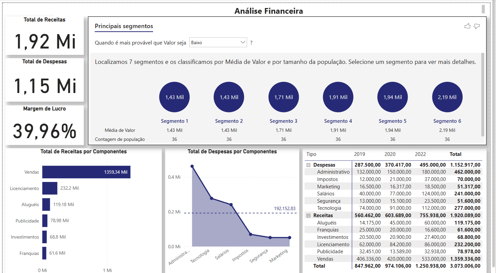

# 📊 Mini Projeto 5 - Análise Financeira com Power BI

Este projeto tem como objetivo construir um dashboard financeiro interativo no Power BI para análise de receitas, despesas e margem de lucro da empresa, com base em um conjunto de dados fictício.

## 🖼️ Visão Geral do Dashboard

## ✅ Indicadores Analisados

- Total de Receitas  
- Total de Despesas  
- Margem de Lucro  
- Receitas por Componente  
- Despesas por Componente em relação à média  
- Receitas e Despesas por Componente e por Ano, utilizando a hierarquia Tipo → Componente  

## 🎯 Objetivo do Projeto

Oferecer uma visão clara e estratégica da saúde financeira da empresa, destacando os segmentos com maior e menor desempenho em termos de receitas e despesas. Essa análise auxilia na definição de planos de ação e decisões gerenciais.

## 🛠️ Ferramentas e Recursos Utilizados

- Power BI Desktop  
- Modelagem de dados com relacionamentos  
- Medidas DAX para cálculo de indicadores como margem de lucro e médias  
- Segmentações e filtros visuais  
- Hierarquias para análise detalhada por tipo e componente ao longo do tempo  

## 📈 Resultados

O dashboard final permite à empresa visualizar rapidamente:

- Onde estão concentradas as maiores receitas e despesas  
- Quais componentes estão acima ou abaixo da média  
- Como os indicadores evoluíram ao longo dos anos  

---

> Projeto desenvolvido como parte de uma atividade prática para aprimoramento em análise de dados com Power BI.
